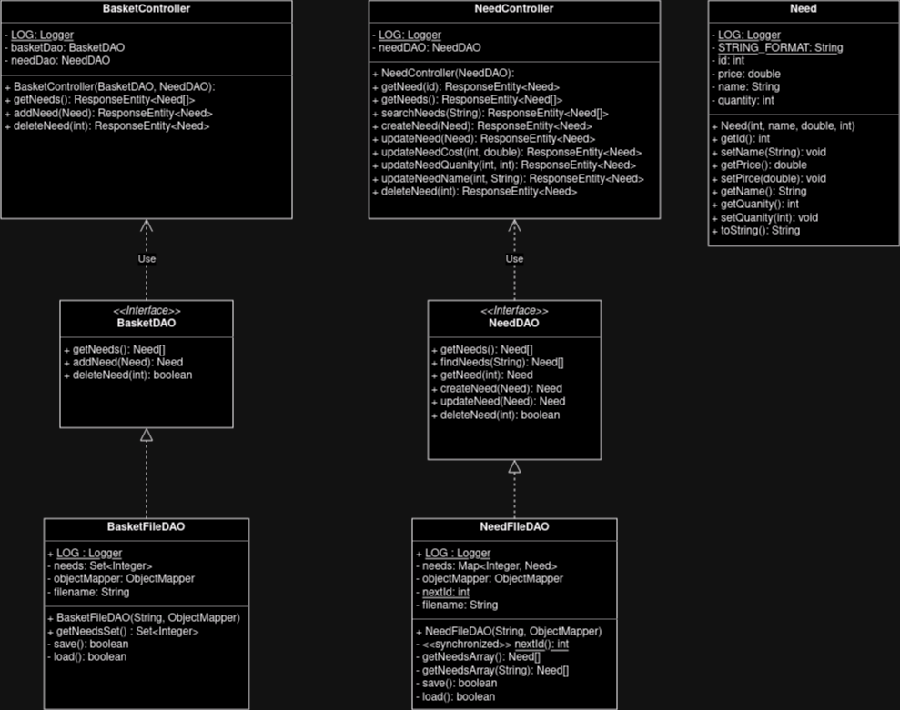

# PROJECT Design Documentation

> _The following template provides the headings for your Design
> Documentation.  As you edit each section make sure you remove these
> commentary 'blockquotes'; the lines that start with a > character
> and appear in the generated PDF in italics._

## Team Information
* Team name: Music Magic
* Team members
  * Teddy Davies
  * Aaliyah Dalhouse
  * Daniel Tsouri
  * Omar Morales-Saez
  * Sean Gaines

## Executive Summary

The New Orleans Music Fund website allows organizers to maintain a list of needs 
requested by various public school music departments. These needs can then be 
viewed by potential helpers, who can choose to donate in order to buy these needs
for the respective schools. 

### Purpose
>  _**[Sprint 2 & 4]** Provide a very brief statement about the project and the most
> important user group and user goals._
Allows administrators to add needs to a cupboard of needs from which helpers can 
add needs to their basket and fund them. 

### Glossary and Acronyms
> _**[Sprint 2 & 4]** Provide a table of terms and acronyms._

| Term | Definition |
|------|------------|
| SPA | Single Page |
| HTTP | Hypertext Transfer Protocol |
| API | Application Programming Interface |
| IDE | Integrated Development Environment |
| CRUD | Create, read, update, and delete |
| JSON |  JavaScript Object Notation |
| OOP |  Object Oriented Proggraming |

## Requirements

This section describes the features of the application.

> _In this section you do not need to be exhaustive and list every
> story.  Focus on top-level features from the Vision document and
> maybe Epics and critical Stories._

### Definition of MVP
> _**[Sprint 2 & 4]** Provide a simple description of the Minimum Viable Product._
For a minimum viable produce, a user must be able to: 
 * login as either a helper or an admin
 * If they are a helper, see a list of needs and add or remove needs to/from their funding basket.
 * If they are an admin, see a list of needs and add or remove needs from the list. 
 * Both should be able to search the list of needs. 

### MVP Features
>  _**[Sprint 4]** Provide a list of top-level Epics and/or Stories of the MVP._

### Enhancements
> _**[Sprint 4]** Describe what enhancements you have implemented for the project._

## Application Domain

This section describes the application domain.

> _**[Sprint 2 & 4]** Provide a high-level overview of the domain for this application. You
> can discuss the more important domain entities and their relationship
> to each other._

## Architecture and Design

This section describes the application architecture.

### Summary

The following Tiers/Layers model shows a high-level view of the webapp's architecture. 
**NOTE**: detailed diagrams are required in later sections of this document. (_When requested, replace this diagram with your **own** rendition and representations of sample classes of your system_.) 

The web application, is built using the Model–View–ViewModel (MVVM) architecture pattern. 

The Model stores the application data objects including any functionality to provide persistance. 

The View is the client-side SPA built with Angular utilizing HTML, CSS and TypeScript. The ViewModel provides RESTful APIs to the client (View) as well as any logic required to manipulate the data objects from the Model.

Both the ViewModel and Model are built using Java and Spring Framework. Details of the components within these tiers are supplied below.

### Overview of User Interface

This section describes the web interface flow; this is how the user views and interacts with the web application.

> _Provide a summary of the application's user interface.  Describe, from the user's perspective, the flow of the pages in the web application._

  Any new users is first directed to the login page where they can sign in as either a helper or an admin. 
  
  If they login as an admin they are directed to the administrator view, where they are able to see a list of needs, a button next to each need which allows them to remove a need, a form which lets them add a need, and a search bar which lets them search the needs. 

  If they login as a helper they ared directed to the helper view, where they are able to see a list of and a button next to each need which allows them to add a need to the funding basket. They can also see a funding basket, which they can remove needs from, and a search bar which lets them search the list of needs. 

### View Tier
> _**[Sprint 4]** Provide a summary of the View Tier UI of your architecture.
> Describe the types of components in the tier and describe their
> responsibilities.  This should be a narrative description, i.e. it has
> a flow or "story line" that the reader can follow._

> _**[Sprint 4]** You must  provide at least **2 sequence diagrams** as is relevant to a particular aspects 
> of the design that you are describing.  (**For example**, in a shopping experience application you might create a 
> sequence diagram of a customer searching for an item and adding to their cart.)
> As these can span multiple tiers, be sure to include an relevant HTTP requests from the client-side to the server-side 
> to help illustrate the end-to-end flow._

> _**[Sprint 4]** To adequately show your system, you will need to present the **class diagrams** where relevant in your design. Some additional tips:_
 >* _Class diagrams only apply to the **ViewModel** and **Model** Tier_
>* _A single class diagram of the entire system will not be effective. You may start with one, but will be need to break it down into smaller sections to account for requirements of each of the Tier static models below._
 >* _Correct labeling of relationships with proper notation for the relationship type, multiplicities, and navigation information will be important._
 >* _Include other details such as attributes and method signatures that you think are needed to support the level of detail in your discussion._

### ViewModel Tier
> _**[Sprint 4]** Provide a summary of this tier of your architecture. This
> section will follow the same instructions that are given for the View
> Tier above._

> _At appropriate places as part of this narrative provide **one** or more updated and **properly labeled**
> static models (UML class diagrams) with some details such as critical attributes and methods._
> 

### Model Tier
> _**[Sprint 2, 3 & 4]** Provide a summary of this tier of your architecture. This
> section will follow the same instructions that are given for the View
> Tier above._

Our api backend functions by maintaining two json files of needs, one representing the cupboard and the other representing the funding basket. The json files are able to be modified by the NeedFileDAO and BasketFileDAO, which are both controlled by the interfaces NeedDAO and BasketDAO respectively. NeedController and BasketController allow editing of the json files using http requests, and the Need class represents one Need itself. 

> _At appropriate places as part of this narrative provide **one** or more updated and **properly labeled**
> static models (UML class diagrams) with some details such as critical attributes and methods._
> 

## OO Design Principles
> _**[Sprint 2, 3 & 4]** Will eventually address upto **4 key OO Principles** in your final design. Follow guidance in augmenting those completed in previous Sprints as indicated to you by instructor. Be sure to include any diagrams (or clearly refer to ones elsewhere in your Tier sections above) to support your claims._
### Sprint 2
* We apply **Single Responsibility** in our project by having classes that are limited to one responsibility. For example we have multiple classes for the funding basket because we have one class that is responsible for the deserialization of the basket.json file and handling of objects, and another class that is responsible for responding to HTTP requests and returning the correct objects for the funding basket.
* We apply **Open/Closed** in our project by extending interfaces such as NeedDAO and BasketDAO into the new classes NeedFileDAO and BasketFileDAO respectively. This allows us to make modifications to the child classes while keeping the parent class untouched.

> _**[Sprint 3 & 4]** OO Design Principles should span across **all tiers.**_

## Static Code Analysis/Future Design Improvements
> _**[Sprint 4]** With the results from the Static Code Analysis exercise, 
> **Identify 3-4** areas within your code that have been flagged by the Static Code 
> Analysis Tool (SonarQube) and provide your analysis and recommendations.  
> Include any relevant screenshot(s) with each area._

> _**[Sprint 4]** Discuss **future** refactoring and other design improvements your team would explore if the team had additional time._

## Testing
> _This section will provide information about the testing performed
> and the results of the testing._

### Acceptance Testing
> _**[Sprint 2 & 4]** Report on the number of user stories that have passed all their
> acceptance criteria tests, the number that have some acceptance
> criteria tests failing, and the number of user stories that
> have not had any testing yet. Highlight the issues found during
> acceptance testing and if there are any concerns._
* So far, the team has been able to keep up with Acceptance Testing. The entirety of stories in both Sprint 1
  and Sprint 2 have passed all of their acceptance criteria tests. The stories in Sprint 3 do not have
  any tests yet. They wil be assigned tests during the Sprint 3 planning.
  There has not been found any issues with the acceptance tests.

### Unit Testing and Code Coverage
> _**[Sprint 4]** Discuss your unit testing strategy. Report on the code coverage
> achieved from unit testing of the code base. Discuss the team's
> coverage targets, why you selected those values, and how well your
> code coverage met your targets._

>_**[Sprint 2 & 4]** **Include images of your code coverage report.** If there are any anomalies, discuss
> those._
### Sprint 2
* There is one large chunk of code that we are having trouble writing unit tests for, which includes updateNeedCost(), updateNeedquantity(), and updateNeedName. It is hard for us to write unit tests for this code because there was nothing like it in the Heroes api for us to base our code off of.
* Apart from that chunk, we just have a few holes spotted around the place which should be no problem to patch up in Sprint 3.

